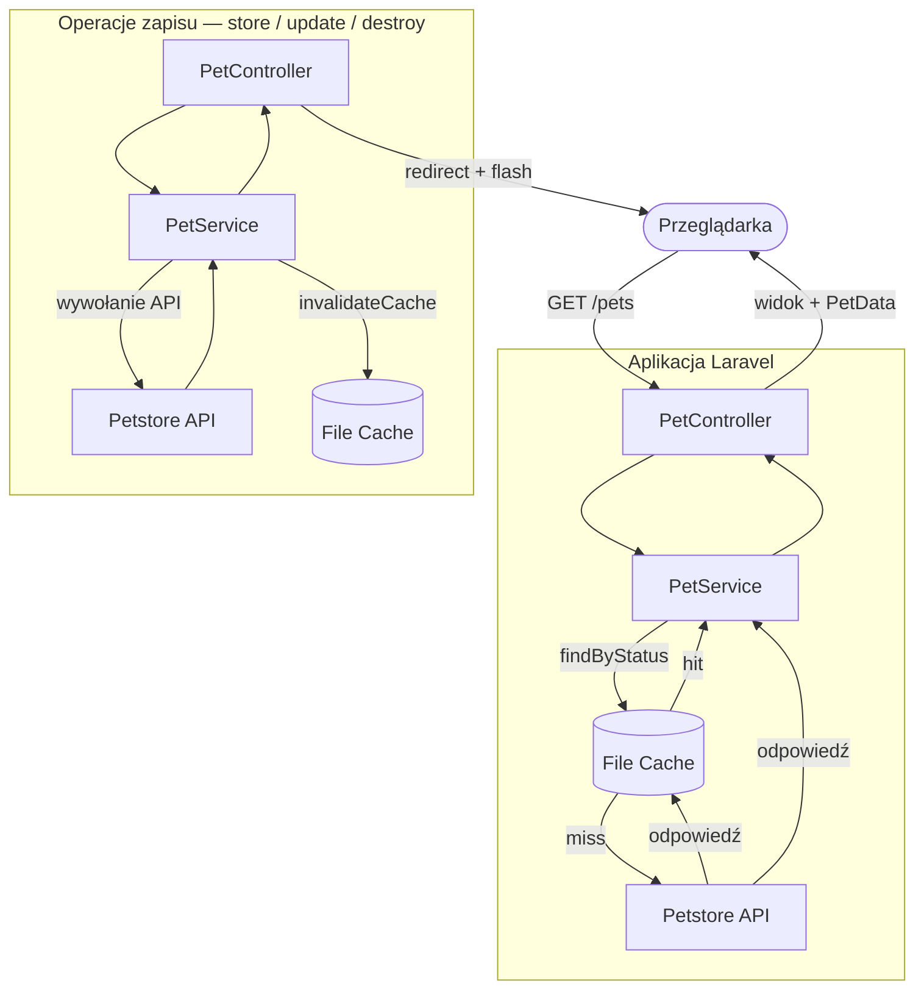

# Petstore

Aplikacja Laravel MVC integrująca się z publicznym [Swagger Petstore API](https://petstore.swagger.io/). Zapewnia pełny CRUD dla zasobu `pet` przez interfejs renderowany w Blade. Brak własnej bazy danych — wszystkie dane pochodzą z zewnętrznego API, z warstwą cache opartą na plikach, która ogranicza zbędne zapytania.


> Angielska wersja tego README jest dostępna w [README.md](README.md).

---

## Stack

| Warstwa | Technologia |
|---|---|
| Backend | PHP 8.3, Laravel 13, szablony Blade |
| Cache | File cache driver (wbudowany w Laravel) |
| Frontend | Tailwind CSS v4, TypeScript, Vite |
| Testy | Pest |
| Infrastruktura | Docker (PHP-FPM + Nginx), WSL2 |
| Jakość kodu | PHPStan level 6 + Larastan, Laravel Pint |

---

## Struktura folderów

```text
app/
├── DTOs/
│   └── PetData.php              # readonly DTO mapujące odpowiedź API
├── Enums/
│   ├── PetStatus.php            # available | pending | sold | unknown
│   └── PetStoreError.php        # definicje komunikatów błędów
├── Exceptions/
│   ├── PetStoreException.php    # abstrakcyjna baza (extends RuntimeException)
│   ├── PetNotFoundException.php
│   ├── PetStoreUnavailableException.php
│   └── PetStoreApiException.php
├── Http/
│   ├── Controllers/
│   │   └── PetController.php    # resource controller, deleguje do PetService
│   └── Requests/
│       ├── PetRequest.php       # walidacja dla store/update
│       └── IndexPetRequest.php  # walidacja filtrów w index
└── Services/
    └── PetService.php           # cała komunikacja z API + logika cache

resources/
├── js/
│   ├── dynamicList.ts           # wspólna abstrakcja dla dynamicznych list inputów
│   ├── tags.ts                  # lista tagów — używa createDynamicList
│   ├── photoUrls.ts             # lista URL zdjęć — używa createDynamicList
│   └── formErrorHandler.ts     # narzędzie do wyświetlania błędów inline
└── views/
    ├── layouts/
    │   └── app.blade.php
    ├── components/
    │   ├── alert.blade.php
    │   ├── badge.blade.php
    │   ├── button.blade.php
    │   ├── card.blade.php
    │   ├── delete-form.blade.php
    │   └── input.blade.php
    └── pets/
        ├── index.blade.php      # lista z filtrami i paginacją
        ├── show.blade.php
        ├── create.blade.php
        └── edit.blade.php

tests/
├── Unit/Services/
│   └── PetServiceTest.php
└── Feature/Http/Controllers/
    └── PetControllerTest.php

config/
└── petstore.php                 # zmienne PETSTORE_* z .env
```

---

## Przepływ danych

Każde żądanie przechodzi przez następującą ścieżkę:

```text
Przeglądarka (request) → PetController → PetService → [cache] → Petstore API → widok Blade → Przeglądarka (response)
```

**Żądania odczytu** (`index`, `show`):
1. Kontroler odbiera żądanie i deleguje do `PetService`
2. Serwis sprawdza file cache (`pets.available`, `pets.pending`, `pets.sold`)
3. **Cache hit** — zwraca dane z cache bez wywołania API
4. **Cache miss** — wywołuje Petstore API, mapuje odpowiedź do `PetData[]`, zapisuje w cache
5. Kontroler przekazuje DTO do widoku Blade

**Żądania zapisu** (`store`, `update`, `destroy`):
1. `PetRequest` waliduje dane formularza przed dotarciem do kontrolera
2. Kontroler deleguje do `PetService`
3. Serwis wywołuje Petstore API
4. Po sukcesie — unieważnia wszystkie trzy klucze cache (`pets.available`, `pets.pending`, `pets.sold`)
5. Kontroler przekierowuje z flash message

**Obsługa błędów:**
- `PetNotFoundException` — przechwytywana per-metoda w kontrolerze (różne przekierowanie w zależności od kontekstu)
- `PetStoreUnavailableException`, `PetStoreApiException` — przechwytywane przez globalny handler w `bootstrap/app.php`, przekierowanie z flash error

---

## Diagram przepływu danych



---

## Instalacja i uruchomienie

### Pierwsze uruchomienie (nowy PC / świeże repo)

```bash
git clone https://github.com/MKabaja/Petstore.git
cd Petstore
cp .env.example .env
```

Sprawdź swój UID:

```bash
id
```

Jeśli inny niż `1000`, zmień w `.env`:

```env
WWWUSER=twój_uid
WWWGROUP=twój_gid
```

```bash
docker compose build --no-cache
docker compose up -d
docker exec petstore_app composer install
docker exec petstore_app php artisan key:generate
```

Otwórz [http://localhost:8000](http://localhost:8000).

### Kolejne uruchomienia (po przerwie)

```bash
docker compose up -d
```

### Po pull z repo (zmiany w composer.json)

```bash
docker exec petstore_app composer install
```

### Reset — gdy coś nie działa z uprawnieniami

```bash
sudo rm -rf vendor storage/framework/cache/data/*
docker compose down --rmi all
docker compose build --no-cache
docker compose up -d
docker exec petstore_app composer install
docker exec petstore_app php artisan cache:clear
```

---

## Zmienne środowiskowe

Wszystkie zmienne specyficzne dla Petstore są zdefiniowane w `config/petstore.php` i odczytywane przez `config()` — nigdy bezpośrednio przez `env()` w kodzie aplikacji.

| Zmienna | Domyślna wartość | Opis |
|---|---|---|
| `PETSTORE_BASE_URL` | `https://petstore.swagger.io/v2` | Bazowy URL zewnętrznego API |
| `PETSTORE_API_KEY` | `special-key` | Klucz API wysyłany jako nagłówek `api_key` |
| `PETSTORE_CACHE_TTL` | `300` | TTL cache w sekundach |
| `PETSTORE_TIMEOUT` | `10` | Timeout klienta HTTP (sekundy) |
| `PETSTORE_RETRY` | `2` | Liczba ponowień przy błędzie połączenia |
| `CACHE_STORE` | `file` | Driver cache Laravela |
| `WWWUSER` | `1000` | UID hosta — musi zgadzać się z `id` na WSL/Linux |
| `WWWGROUP` | `1000` | GID hosta |

---

## Skrypty composera

| Komenda | Co robi |
|---|---|
| `composer test` | Czyści cache konfiguracji i uruchamia testy |
| `composer lint` | Uruchamia Laravel Pint (styl kodu) |
| `composer analyse` | Uruchamia PHPStan level 6 |
| `composer check` | Uruchamia lint + analyse + testy po kolei |

## Uruchamianie testów

```bash
composer test
```

Podczas testów używany jest `CACHE_STORE=array` (skonfigurowany w `phpunit.xml`) — żadne pliki cache nie są zapisywane.

**Testy jednostkowe** — `Tests\Unit\Services\PetServiceTest`

Testują warstwę serwisu w izolacji. `Http::fake()` przechwytuje wszystkie wychodzące żądania HTTP — żadne realne wywołania API nie są wykonywane. Pokrywają wszystkie pięć publicznych metod i weryfikują działanie cache przez `Http::assertSentCount(1)`.

**Testy funkcjonalne** — `Tests\Feature\Http\Controllers\PetControllerTest`

Testują pełną warstwę HTTP: routing → kontroler → odpowiedź. `PetService` jest zastąpiony mockiem Mockery przez `$this->mock()`. Pokrywają przekierowania, flash messages i błędy walidacji formularzy.

---

## Testowanie z realnymi danymi — URL zdjęć

Podczas tworzenia lub edycji zwierzaka, URL zdjęcia musi być **bezpośrednim linkiem do pliku obrazu**. Linki z Google Images nie zadziałają — przeglądarka je wyświetla, ale nie są to bezpośrednie adresy plików.

Do testów użyj tych serwisów placeholder:

- `https://placedog.net/500/500`
- `https://placekitten.com/500/500`

Liczby w URL możesz dowolnie zmieniać, żeby uzyskać inne zdjęcia — np. `https://placedog.net/300/400` lub `https://placekitten.com/200/200`.

Ewentualnie kliknij prawym przyciskiem na dowolny obraz w przeglądarce → **Kopiuj adres obrazu**, żeby uzyskać bezpośredni URL.

> **Uwaga:** Petstore API jest publiczne — każdy może dodać zwierzaka z niedziałającym linkiem do zdjęcia. To zachowanie oczekiwane. Aplikacja radzi sobie z tym przez `onerror` — przy błędzie ładowania obrazu wyświetlany jest lokalny placeholder z `public/images/`.
