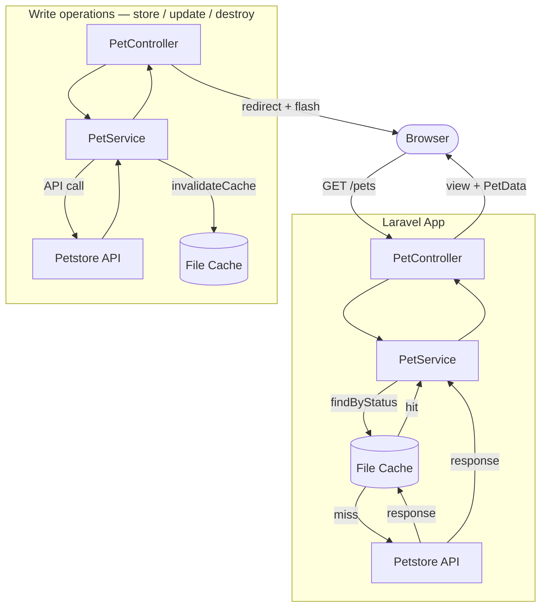

# Petstore

A Laravel MVC application integrating with the public [Swagger Petstore API](https://petstore.swagger.io/). Provides full CRUD for the `pet` resource through a Blade-rendered web interface. No own database — all data comes from the external API, with a file-based cache layer to reduce redundant requests.


> Polish version of this README is available in [README-pl.md](README-pl.md).

---

## Stack

| Layer | Technology |
|---|---|
| Backend | PHP 8.3, Laravel 13, Blade templates |
| Caching | File cache driver (Laravel built-in) |
| Frontend | Tailwind CSS v4, TypeScript, Vite |
| Testing | Pest |
| Infrastructure | Docker (PHP-FPM + Nginx), WSL2 |
| Code quality | PHPStan level 6 + Larastan, Laravel Pint |

---

## Folder structure

```
app/
├── DTOs/
│   └── PetData.php              # readonly DTO mapping API response
├── Enums/
│   ├── PetStatus.php            # available | pending | sold | unknown
│   └── PetStoreError.php        # error message definitions
├── Exceptions/
│   ├── PetStoreException.php    # abstract base (extends RuntimeException)
│   ├── PetNotFoundException.php
│   ├── PetStoreUnavailableException.php
│   └── PetStoreApiException.php
├── Http/
│   ├── Controllers/
│   │   └── PetController.php    # resource controller, delegates to PetService
│   └── Requests/
│       ├── PetRequest.php       # validation for store/update
│       └── IndexPetRequest.php  # validation for index filters
└── Services/
    └── PetService.php           # all API communication + cache logic

resources/
├── js/
│   ├── dynamicList.ts           # shared abstraction for dynamic input lists
│   ├── tags.ts                  # tag list — uses createDynamicList
│   ├── photoUrls.ts             # photo URL list — uses createDynamicList
│   └── formErrorHandler.ts     # inline error display utility
└── views/
    ├── layouts/
    │   └── app.blade.php
    ├── components/
    │   ├── alert.blade.php
    │   ├── badge.blade.php
    │   ├── button.blade.php
    │   ├── card.blade.php
    │   ├── delete-form.blade.php
    │   └── input.blade.php
    └── pets/
        ├── index.blade.php      # listing with filters and pagination
        ├── show.blade.php
        ├── create.blade.php
        └── edit.blade.php

tests/
├── Unit/Services/
│   └── PetServiceTest.php
└── Feature/Http/Controllers/
    └── PetControllerTest.php

config/
└── petstore.php                 # PETSTORE_* env vars
```

---

## Data flow

Every request follows this path:

```
Browser (request) → PetController → PetService → [cache check] → Petstore API → Blade view → Browser (response)
```

**Read requests** (`index`, `show`):
1. Controller receives request, delegates to `PetService`
2. Service checks file cache (`pets.available`, `pets.pending`, `pets.sold`)
3. **Cache hit** — returns cached data immediately, no API call
4. **Cache miss** — calls Petstore API, maps response to `PetData[]`, stores in cache
5. Controller passes DTOs to Blade view

**Write requests** (`store`, `update`, `destroy`):
1. `PetRequest` validates form data before reaching the controller
2. Controller delegates to `PetService`
3. Service calls Petstore API
4. On success — invalidates all three cache keys (`pets.available`, `pets.pending`, `pets.sold`)
5. Controller redirects with flash message

**Error handling:**
- `PetNotFoundException` — caught per-method in the controller (different redirect per context)
- `PetStoreUnavailableException`, `PetStoreApiException` — caught by global handler in `bootstrap/app.php`, redirects back with error flash

---

## Data flow diagram



---

## Installation & running

### First run (new machine / fresh clone)

```bash
git clone https://github.com/MKabaja/Petstore.git
cd Petstore
cp .env.example .env
```

Check your UID:

```bash
id
```

If it differs from `1000`, update `.env`:

```env
WWWUSER=your_uid
WWWGROUP=your_gid
```

```bash
docker compose build --no-cache
docker compose up -d
docker exec petstore_app composer install
docker exec petstore_app php artisan key:generate
```

Open [http://localhost:8080](http://localhost:8080).

### Subsequent runs (after a break)

```bash
docker compose up -d
```

### After pulling changes (composer.json updated)

```bash
docker exec petstore_app composer install
```

### Reset — when permissions break

```bash
sudo rm -rf vendor storage/framework/cache/data/*
docker compose down --rmi all
docker compose build --no-cache
docker compose up -d
docker exec petstore_app composer install
docker exec petstore_app php artisan cache:clear
```

---

## Environment variables

All Petstore-specific variables live in `config/petstore.php` and are read via `config()` — never via `env()` directly in application code.

| Variable | Default | Description |
|---|---|---|
| `PETSTORE_BASE_URL` | `https://petstore.swagger.io/v2` | Base URL of the external API |
| `PETSTORE_API_KEY` | `special-key` | API key sent as `api_key` header |
| `PETSTORE_CACHE_TTL` | `300` | Cache TTL in seconds |
| `PETSTORE_TIMEOUT` | `10` | HTTP client timeout (seconds) |
| `PETSTORE_RETRY` | `2` | Number of retries on connection failure |
| `CACHE_STORE` | `file` | Laravel cache driver |
| `WWWUSER` | `1000` | Host UID — must match output of `id` on WSL/Linux |
| `WWWGROUP` | `1000` | Host GID |

---

## Composer scripts

| Command | What it does |
|---|---|
| `composer test` | Clears config cache and runs the test suite |
| `composer lint` | Runs Laravel Pint (code style) |
| `composer analyse` | Runs PHPStan level 6 |
| `composer check` | Runs lint + analyse + tests in sequence |

## Running tests

```bash
composer test
```

The test suite uses `CACHE_STORE=array` (configured in `phpunit.xml`) so no real files are written during testing.

**Unit tests** — `Tests\Unit\Services\PetServiceTest`

Test the service layer in isolation. `Http::fake()` intercepts all outgoing HTTP requests — no real API calls are made. Covers all five public methods and verifies cache hit behaviour via `Http::assertSentCount(1)`.

**Feature tests** — `Tests\Feature\Http\Controllers\PetControllerTest`

Test the full HTTP layer: routing → controller → response. `PetService` is replaced with a Mockery mock via `$this->mock()`. Covers redirects, flash messages, and form validation errors.

---

## Testing with real data — photo URLs

When creating or editing a pet, the photo URL must be a **direct link to an image file**. Google Images URLs will not work — the browser displays them, but they are not direct image addresses.

Use these placeholder services for testing:

- `https://placedog.net/500/500`
- `https://placekitten.com/500/500`

You can change the numbers in the URL to get different images — for example `https://placedog.net/300/400` or `https://placekitten.com/200/200`.

Alternatively, right-click any image in the browser → **Copy image address** to get a direct URL.

> **Note:** The Petstore API is public — anyone can add pets with broken or dead image links. This is expected behaviour. The app handles it gracefully with an `onerror` fallback to a local placeholder image stored in `public/images/`.
